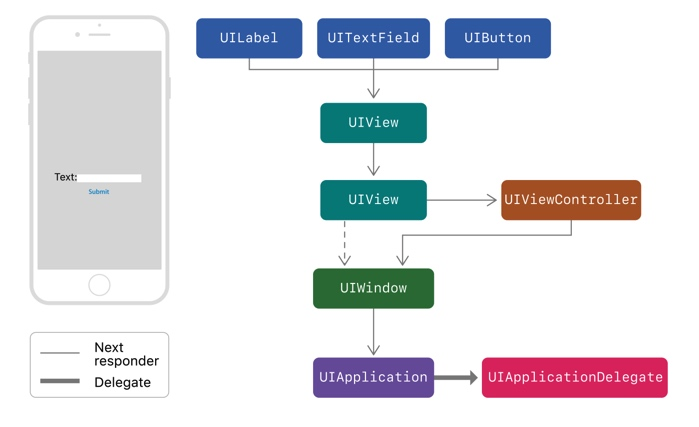
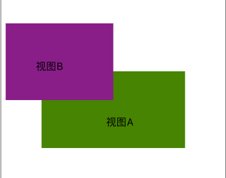

# iOS中的事件响应

##概要
应用程序使用**响应对象**来接收与处理事件。响应对象是`UIResponder`的任一实例，常见的`UIResponder`的子类包括：`UIView`、`UIViewController`、以及`UIApplication`。响应者接收原生事件数据并且必须处理事件或者将事件传递给其他响应者。当应用程序接收到一个事件，UIKit会将事件自动传递给最适合的响应者，即所谓的第一响应者。未被处理的事件将会在活跃的响应链中的响应者之间传递，响应链是应用程序所有响应者的一种动态描述。应用程序中不存在单一响应链。UIKit为事件从一个响应者传递到下一个响应者定义了默认规则，但你总是可以通过重写响应者适当的属性来改变这些规则。图1展示了一个App的默认响应链，该App的界面上包含一个label、一个textfield、一个button、以及两个背景视图。如果textfield没有处理事件，UIKit将事件发送给textfiled的父视图，接下来是window的根视图。从根视图开始，在事件被传递给window之前，事件会被先传递给持有根视图的控制器。如果window没有处理事件，UIKit将事件传递给`UIApplication`对象，很有可能交由UIApplicationDelegate对象处理。UIApplicationDelegate对象能够处理事件的条件是：是UIResponder的实例且尚未成为响应链中的一部分。


## 确定事件的第一响应者
UIKit为每种类型的事件指定了第一响应者并且将事件发送给第一响应者，事件的第一响应者由其类型决定。

1. 触摸事件：第一响应者是事件发生的视图。
1. 按压事件：第一响应者是当前正被聚焦的响应对象。
1. 摇晃事件：第一响应者由编码人员（或UIKit）指定。
1. 旋转事件：第一响应者由编码人员（或UIKit）指定。
1. 编辑菜单消息：第一响应者由编码人员（或UIKit）指定。

>**Note**
>
>1. 与加速器、陀螺仪、磁力仪相关的动作并不有响应链处理。CoreMotion将事件直接传递给编码人员指定的对象。更多相关信息，参见[Core Motion FrameWork](https://developer.apple.com/library/content/documentation/Miscellaneous/Conceptual/iPhoneOSTechOverview/CoreServicesLayer/CoreServicesLayer.html#//apple_ref/doc/uid/TP40007898-CH10-SW27)。
>2. 按压事件发生之前必定触发触摸事件，触摸事件会由UIKit指定第一响应对象，这个对象就是**当前被聚焦的响应对象**。

`UIControl`对象（如`UIButton`）使用动作消息与其关联的对象直接通信（`target-action`）。当用户与一个`UIControl`对象发生交互时，`UIControl`对象会调用与其关联的对象中指定的方法。换句话说，UIControl对象向与其关联的对象发送一个动作消息。动作消息不是事件，但是动作消息仍然可以利用响应链。当动作消息的目标对象（target object）为nil时，UIKit会从该目标对象开始遍历响应链直到找到一个实现了对应方法的对象。例如，UIkit中的菜单编辑使用这种行为来搜索一个实现了形如 ` cut:`,`copy:`,`paste:`等方法的对象，菜单编辑的相关事件将由该对象处理。

如果一个视图添加了手势识别器，手势识别器会在视图接收到触摸与按压事件之前接收到这些事件。如果视图已添加的所有手势识别器都不能识别各自的手势，则当前事件会交由视图处理。如果视图没有处理该事件，UIKit会将事件传递给响应链。更多与手势相关的信息，[参见](https://developer.apple.com/documentation/uikit/touches_presses_and_gestures/handling_uikit_gestures)。

## 确定哪个响应者包含触摸事件
UIKit使用基于视图的命中测试来确定事件发生的位置。特别地，UIKit会将触摸位置与视图层级中的视图对象的边界进行比较。UIView的` hitTest:withEvent: `方法会遍历整个视图层级，寻找包含指定触摸的最深的子视图。该子视图就是该触摸事件的第一响应者。

<span id="NOTE2"></span>
>**NOTE**
>
>假设有一个**视图A**,如果触摸的位置在位于视图A的边界之外，` hitTest:withEvent:  `会忽略视图A以及视图A的所有子视图。这样做的结果是，当视图A的`clipsToBounds`属性为`false`时，超出视图A边界的子视图在发生事件时函数也不会返回。这里的函数是指` hitTest:withEvent:  `不会将子视图返回，也就是说**视图A不能捕捉发生在超出其边界之外的事件**。更多相关信息，[参见](https://developer.apple.com/documentation/uikit/uiview/1622469-hittest)。
 
对于[NOTE](#NOTE2)中关于视图A的讨论部分我们用简单的代码来验证，首先将两个视图A、B分别添加到Storyboard上，其中视图B是视图A的子视图，如下所示。



然后将绿色视图绑定到一个类上，在这里是RJGreenView，然后在RJGreenView中重写以下方法。

```obj-c
- (void)touchesBegan:(NSSet<UITouch *> *)touches withEvent:(UIEvent *)event {
    
    NSLog(@"开始");
}
- (void)touchesEnded:(NSSet<UITouch *> *)touches withEvent:(UIEvent *)event{
    
    NSLog(@"结束");
}
```

运行程序后，我们点击超出视图A边界部分，将不会输出任何信息，即**视图A不能捕捉发生在超出其边界之外的事件**。

UIKit将每个触摸事件永久分配给包含它的视图。UIKit仅在触摸事件第一次发生时创建UITouch对象，在触摸事件结束后才会释放该UITouch对象。当触摸位置或者其他参数发生改变时，UIKit将会使用新的信息来更新UITouch对象。UITouch对象唯一不会发生改变的属性是其包含的视图。甚至当触摸的位置移出原始的视图，UITouch对象包含的视图也不会发生改变。


## 改变事件响应链
编码人员可以通过重写响应对象nextResponder属性来改变事件的响应链。当你这样做时，nextResponder就是你返回的对象。
许多UIKit中的类已经重写了这个属性并且返回了指定对象。

* UIView对象：如果view是一个控制器的根视图，nextResponder就是该控制器。除此之外，nextResponder是view的父视图。
* UIViewController对象：
    * 如果视图控制器的View是一个window的根视图（root view），nextResponder就是该window。
    * 如果控制器是被其他控制器模态弹出，nextResponder就是正在呈现的控制器。
* UIWindow对象：nextResponder是UIApplication对象。
* UIApplication对象：nextResponder是UIApplicationDelegate对象。UIApplicationDelegate对象能够作为UIApplication的nextResponder的条件是：（1）是UIResponder的实例；（2）不是View、ViewController以及UIApplication对象本身（app.delegate = app)。


## 参考
[https://developer.apple.com/documentation/uikit/touches_presses_and_gestures/understanding_event_handling_responders_and_the_responder_chain?language=objc](https://developer.apple.com/documentation/uikit/touches_presses_and_gestures/understanding_event_handling_responders_and_the_responder_chain?language=objc)

